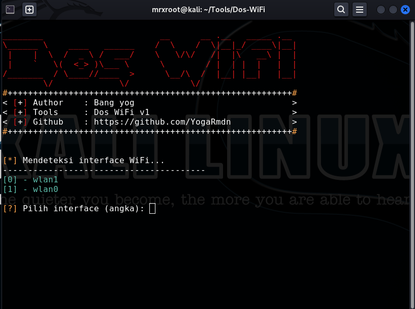

## Tools deauth simple dengan Python
Tools ini dibuat agar proses aktifkan mode monitor & deauth lebih simple dan bisa di pakai oleh pemula

## Warning!!
Tools ini hanya support pada Ubuntu, Kali Linux, dan Parrot Security

## Cara penggunaan tools
- git clone https://github.com/YogaRmdn/Dos_WiFi.git
- cd Dos_WiFi
- sudo python doswifi.py / sudo python3 doswifi.py
- Boom

## Screenshot Tools

